# ACE Codebase Mermaid Diagrams

This document contains various Mermaid diagrams visualizing the structure and relationships within the ACE codebase, generated from our code maps.

## Table of Contents

1. [System Architecture Diagrams](#system-architecture-diagrams)
   - [Core Module Structure](#core-module-structure)
   - [Web Application Structure](#web-application-structure)
2. [API Routes Diagram](#api-routes-diagram)
3. [Core Module Dependencies](#core-module-dependencies)
4. [GitHub Integration Flow](#github-integration-flow)
5. [Code Evolution Process](#code-evolution-process)
6. [Optimization Process Flow](#optimization-process-flow)
7. [Component Hierarchy](#component-hierarchy)
8. [File Complexity Heat Map](#file-complexity-heat-map)
9. [Language Optimization Support](#language-optimization-support)
10. [GitHub Integration Architecture](#github-integration-architecture)
11. [Evolution Process Timeline](#evolution-process-timeline)
12. [Technical Debt Map](#technical-debt-map)
13. [AI Orchestration Flow](#ai-orchestration-flow)
14. [Database Schema Relationships](#database-schema-relationships)
15. [Test Coverage Map](#test-coverage-map)
16. [Development Workflow](#development-workflow)
17. [File Modification Frequency](#file-modification-frequency)

## System Architecture Diagrams

### Core Module Structure

```mermaid
graph TD
    ACE[Ace]
    ACE --> Analysis[Ace.Analysis]
    ACE --> Evaluation[Ace.Evaluation]
    ACE --> Optimization[Ace.Optimization]
    ACE --> Core[Ace.Core]
    ACE --> Evolution[Ace.Evolution]
    ACE --> GitHub[Ace.GitHub]
    ACE --> Infrastructure[Ace.Infrastructure]
    ACE --> GraphQL[Ace.GraphQL]
    
    Infrastructure --> AI[Ace.Infrastructure.AI]
    Infrastructure --> Persistence[Ace.Infrastructure.Persistence]
    
    AI --> Orchestrator[AI.Orchestrator]
    AI --> CodeOptimizer[AI.CodeOptimizer]
    AI --> OpportunityWrapper[AI.OpportunityWrapper]
    AI --> Providers[AI.Providers]
    
    Providers --> Groq[AI.Providers.Groq]
    
    Core --> Models[Core.Models]
    Core --> Schemas[Core.Schemas]
    Models --> EvolutionProposal[Core.EvolutionProposal]
    
    GitHub --> GitHubModels[GitHub.Models]
    GitHub --> GitHubAPI[GitHub.GitHubAPI]
    GitHub --> Service[GitHub.Service]
    GitHub --> PRCreator[GitHub.PRCreator]
    GitHub --> AppAuth[GitHub.AppAuth]
    GitHub --> OptimizationAdapter[GitHub.OptimizationAdapter]
    
    GitHubModels --> PullRequest[GitHub.Models.PullRequest]
    GitHubModels --> PRFile[GitHub.Models.PRFile]
    GitHubModels --> OptimizationSuggestion[GitHub.Models.OptimizationSuggestion]
    
    Optimization --> Languages[Optimization.Languages]
    Languages --> Elixir[Languages.Elixir]
    Languages --> Python[Languages.Python]
    Languages --> JavaScript[Languages.JavaScript]
    Languages --> Ruby[Languages.Ruby]
    Languages --> Go[Languages.Go]
    
    GraphQL --> Resolvers[GraphQL.Resolvers]
    GraphQL --> Types[GraphQL.Types]
    GraphQL --> Schema[GraphQL.Schema]
    
    Evolution --> Service[Evolution.Service]
    Evolution --> Scheduler[Evolution.Scheduler]
    Evolution --> Notification[Evolution.Notification]
    
    classDef core fill:#f9f,stroke:#333,stroke-width:2px;
    classDef infrastructure fill:#bbf,stroke:#333,stroke-width:1px;
    classDef github fill:#bfb,stroke:#333,stroke-width:1px;
    
    class ACE,Core core;
    class Infrastructure,AI,Persistence infrastructure;
    class GitHub,GitHubModels,GitHubAPI github;
```

### Web Application Structure

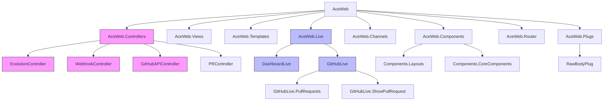

## API Routes Diagram

```mermaid
graph LR
    Browser[Browser Client]
    API[API Client]
    GitHub[GitHub Webhook]
    
    Browser --> BrowserRoutes["/browser routes"]
    API --> APIRoutes["/api routes"]
    GitHub --> WebhookRoutes["/webhooks routes"]
    
    subgraph BrowserRoutes
        direction TB
        BR_HOME["/"]
        BR_PROJECTS["/projects"]
        BR_FILES["/files"]
        BR_OPPORTUNITIES["/opportunities"]
        BR_OPTIMIZATIONS["/optimizations"]
        BR_EVALUATIONS["/evaluations"]
        BR_EVOLUTION["/evolution"]
        BR_EVOLUTION_PROPOSALS["/evolution/proposals"]
        BR_GITHUB_PRS["/github/pull_requests"]
        BR_GITHUB_PR["/github/pull_requests/:id"]
        BR_OPTIMIZE_PR["/optimize/:pr_id"]
    end
    
    subgraph APIRoutes
        direction TB
        API_PULL_REQUESTS["/api/pull_requests"]
        API_ANALYSES_OPTIMIZE["/api/analyses/:id/optimize"]
        API_GITHUB_PULL_REQUESTS["/api/github/pull_requests"]
        API_GITHUB_PR["/api/github/pull_requests/:id"]
        API_GITHUB_PR_OPTIMIZE["/api/github/pull_requests/:id/optimize"]
        API_GITHUB_PR_CREATE_OPTIMIZATION["/api/github/pull_requests/:id/create_optimization_pr"]
        API_GITHUB_PR_SUGGESTIONS["/api/github/pull_requests/:pr_id/suggestions"]
        API_GITHUB_PR_UI["/api/github/pull_requests/:pr_id/ui"]
        API_GITHUB_BRANCHES["/api/github/branches/:repo_name"]
        API_GITHUB_OPTIMIZE["/api/github/optimize"]
        API_GRAPHQL["/api/graphql"]
        API_GRAPHIQL["/api/graphiql"]
    end
    
    subgraph WebhookRoutes
        direction TB
        WH_GITHUB["/webhooks/github"]
    end
    
    classDef browser fill:#bbf,stroke:#333,stroke-width:1px;
    classDef api fill:#bfb,stroke:#333,stroke-width:1px;
    classDef webhook fill:#fbf,stroke:#333,stroke-width:1px;
    
    class BrowserRoutes,BR_HOME,BR_PROJECTS,BR_FILES,BR_OPPORTUNITIES,BR_OPTIMIZATIONS,BR_EVALUATIONS,BR_EVOLUTION,BR_EVOLUTION_PROPOSALS,BR_GITHUB_PRS,BR_GITHUB_PR,BR_OPTIMIZE_PR browser;
    class APIRoutes,API_PULL_REQUESTS,API_ANALYSES_OPTIMIZE,API_GITHUB_PULL_REQUESTS,API_GITHUB_PR,API_GITHUB_PR_OPTIMIZE,API_GITHUB_PR_CREATE_OPTIMIZATION,API_GITHUB_PR_SUGGESTIONS,API_GITHUB_PR_UI,API_GITHUB_BRANCHES,API_GITHUB_OPTIMIZE,API_GRAPHQL,API_GRAPHIQL api;
    class WebhookRoutes,WH_GITHUB webhook;
```

## Core Module Dependencies

```mermaid
flowchart TD
    ACE[Ace] --> Analysis
    ACE --> Evaluation
    ACE --> Optimization
    
    Analysis --> Core_Analysis[Core.Analysis]
    Analysis --> Core_Opportunity[Core.Opportunity]
    Analysis --> AI_Orchestrator[AI.Orchestrator]
    
    Evaluation --> Core_Evaluation[Core.Evaluation]
    Evaluation --> Core_Experiment[Core.Experiment]
    Evaluation --> AI_Orchestrator
    
    Evolution --> Core_EvolutionProposal[Core.EvolutionProposal]
    Evolution --> Evolution_Notification[Evolution.Notification]
    Evolution --> AI_Orchestrator
    
    GitHub --> AppAuth
    GitHub --> Models_PullRequest[Models.PullRequest]
    GitHub --> Models_PRFile[Models.PRFile]
    GitHub --> Models_OptimizationSuggestion[Models.OptimizationSuggestion]
    GitHub --> Service_Analysis[Analysis.Service]
    GitHub --> Service_Evolution[Evolution.Service]
    
    Optimization --> Core_Optimization[Core.Optimization]
    Optimization --> Core_Opportunity
    Optimization --> AI_Orchestrator
    
    AI_Orchestrator --> OpportunityWrapper
    
    GitHub_OptimizationAdapter[GitHub.OptimizationAdapter] --> CodeOptimizer[AI.CodeOptimizer]
    GitHub_OptimizationAdapter --> Service_Evolution
    GitHub_OptimizationAdapter --> Service_Optimization[Optimization.Service]
    
    classDef core fill:#f9f,stroke:#333,stroke-width:1px;
    classDef ai fill:#bbf,stroke:#333,stroke-width:1px;
    classDef github fill:#bfb,stroke:#333,stroke-width:1px;
    
    class ACE core;
    class AI_Orchestrator,OpportunityWrapper,CodeOptimizer ai;
    class GitHub,AppAuth,Models_PullRequest,Models_PRFile,Models_OptimizationSuggestion,GitHub_OptimizationAdapter github;
```

## GitHub Integration Flow

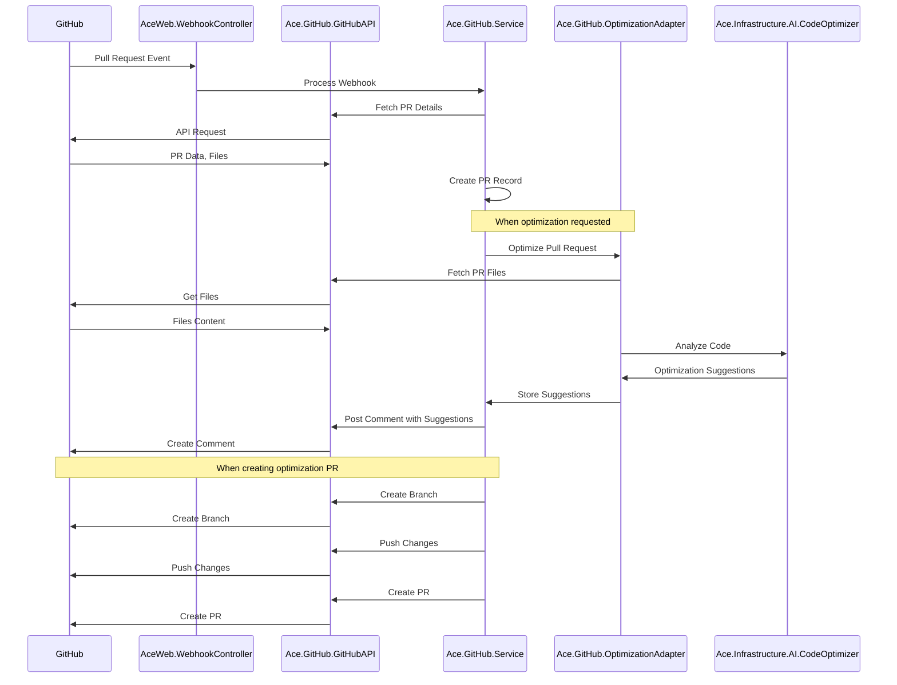

## Code Evolution Process

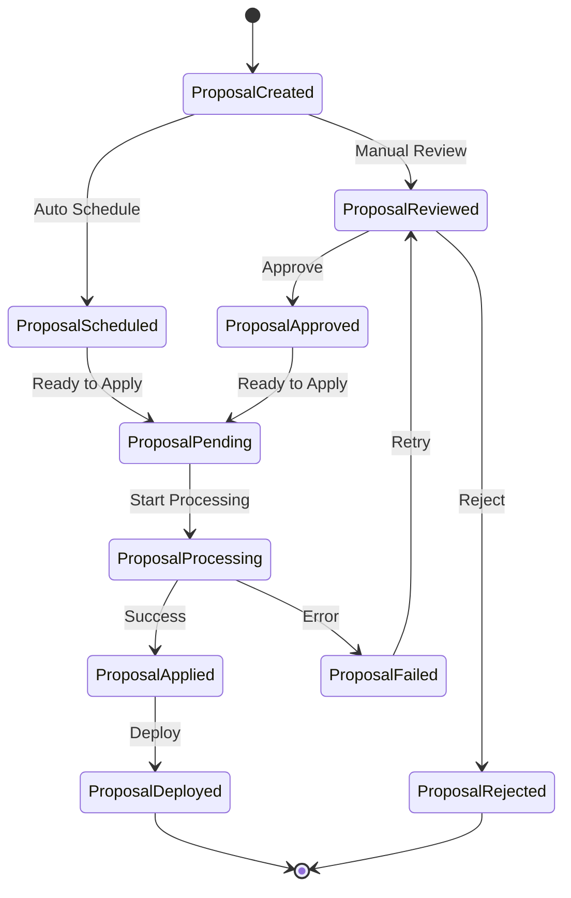

## Optimization Process Flow

```mermaid
graph TD
    Start([Start]) --> DetectCode[Detect Code Files]
    DetectCode --> FilterLanguages[Filter Supported Languages]
    FilterLanguages --> AnalyzeCode[Analyze Code]
    
    AnalyzeCode --> Python[Python Analysis]
    AnalyzeCode --> JavaScript[JavaScript Analysis]
    AnalyzeCode --> Elixir[Elixir Analysis]
    AnalyzeCode --> Ruby[Ruby Analysis]
    AnalyzeCode --> Go[Go Analysis]
    
    Python --> IdentifyOpportunities[Identify Opportunities]
    JavaScript --> IdentifyOpportunities
    Elixir --> IdentifyOpportunities
    Ruby --> IdentifyOpportunities
    Go --> IdentifyOpportunities
    
    IdentifyOpportunities --> GenerateOptimizations[Generate Optimizations]
    GenerateOptimizations --> CreateSuggestions[Create Suggestions]
    CreateSuggestions --> FormatComments[Format Comments]
    FormatComments --> PostToGitHub[Post to GitHub]
    PostToGitHub --> End([End])
    
    classDef start fill:#bbf,stroke:#333,stroke-width:2px;
    classDef process fill:#bfb,stroke:#333,stroke-width:1px;
    classDef languages fill:#fbf,stroke:#333,stroke-width:1px;
    classDef end fill:#fbb,stroke:#333,stroke-width:2px;
    
    class Start start;
    class DetectCode,FilterLanguages,AnalyzeCode,IdentifyOpportunities,GenerateOptimizations,CreateSuggestions,FormatComments,PostToGitHub process;
    class Python,JavaScript,Elixir,Ruby,Go languages;
    class End end;
```

## Component Hierarchy

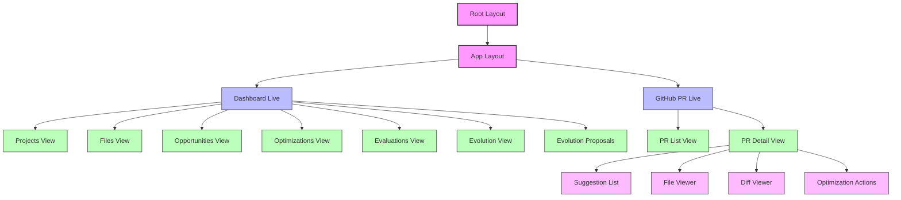

## File Complexity Heat Map

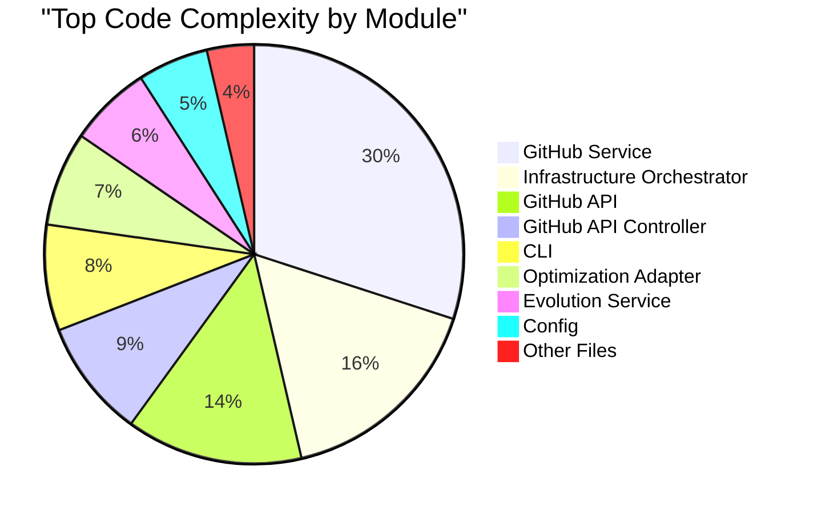

## Language Optimization Support

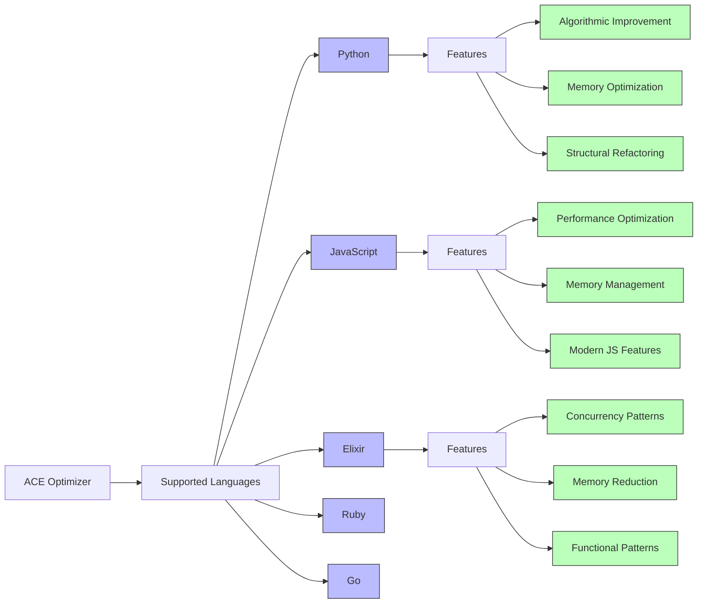

## GitHub Integration Architecture

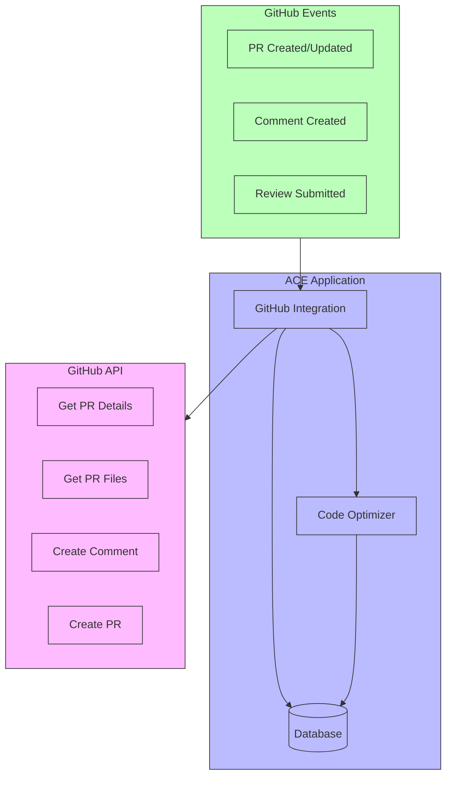

## Evolution Process Timeline

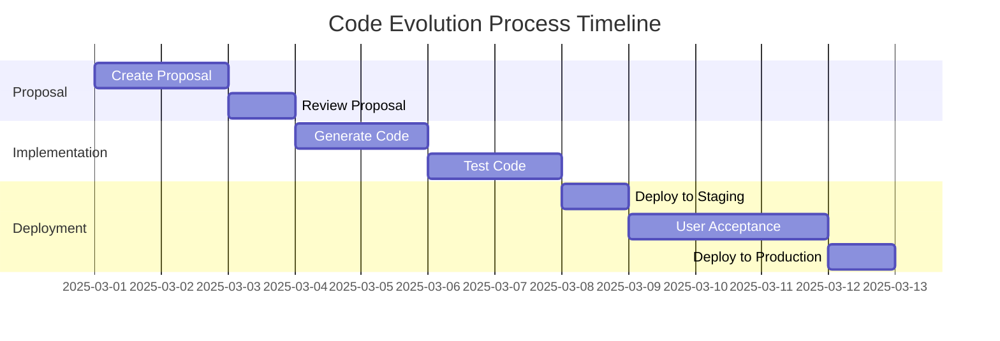

## Technical Debt Map

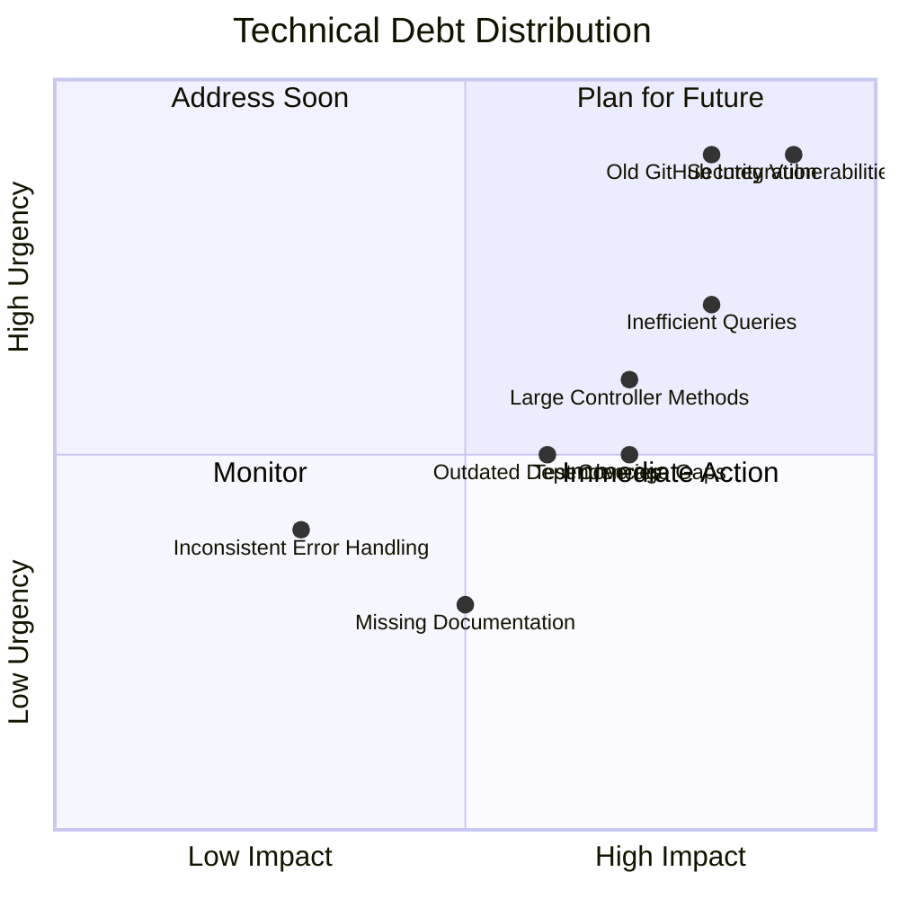

## AI Orchestration Flow

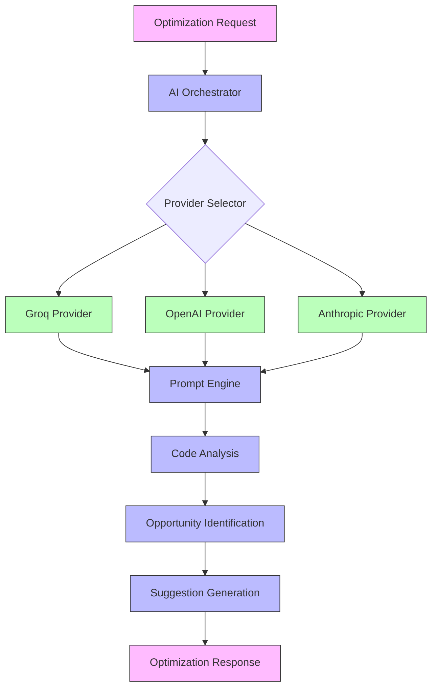

## Database Schema Relationships

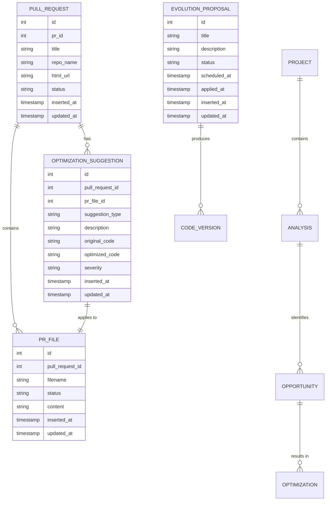

## Test Coverage Map

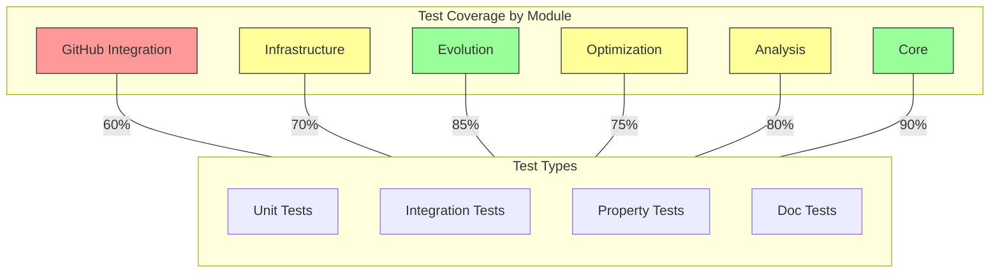

## Development Workflow

```mermaid
stateDiagram-v2
    direction LR
    
    [*] --> Start
    
    state Development {
        Start --> CodeChanges: Implement Feature
        CodeChanges --> UnitTests: Write Tests
        UnitTests --> PRCreation: Create PR
    }
    
    state CIFlow {
        PRCreation --> LintCheck: Run Linters
        LintCheck --> TestSuite: Run Tests
        TestSuite --> CodeCoverage: Check Coverage
    }
    
    state OptimizationFlow {
        CodeCoverage --> ACEAnalysis: ACE Analysis
        ACEAnalysis --> CodeSuggestions: Generate Suggestions
        CodeSuggestions --> PRComments: Add Comments
    }
    
    state ReviewFlow {
        PRComments --> CodeReview: Developer Review
        CodeReview --> ApplySuggestions: Apply Suggestions
        ApplySuggestions --> PRMerge: Merge PR
    }
    
    PRMerge --> [*]
```

## File Modification Frequency

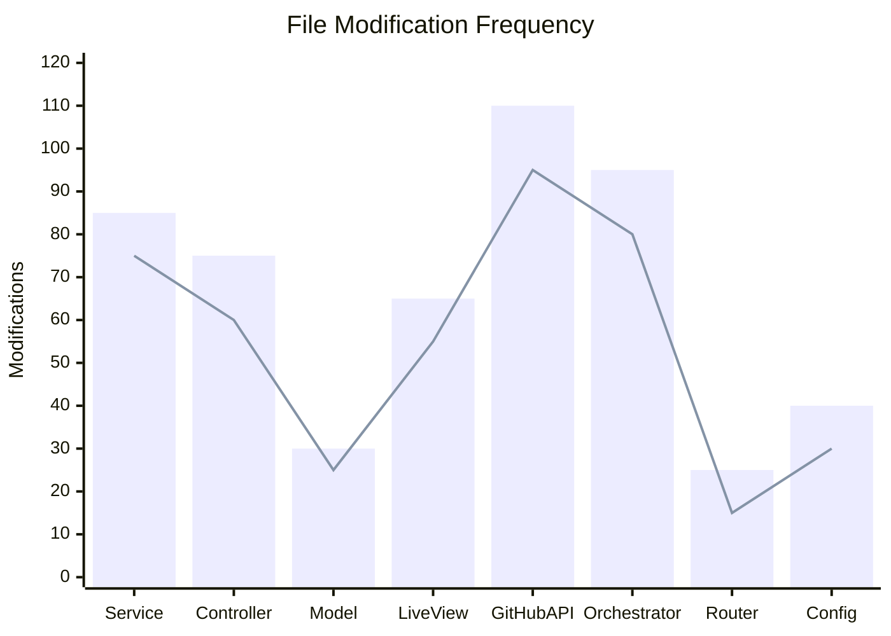